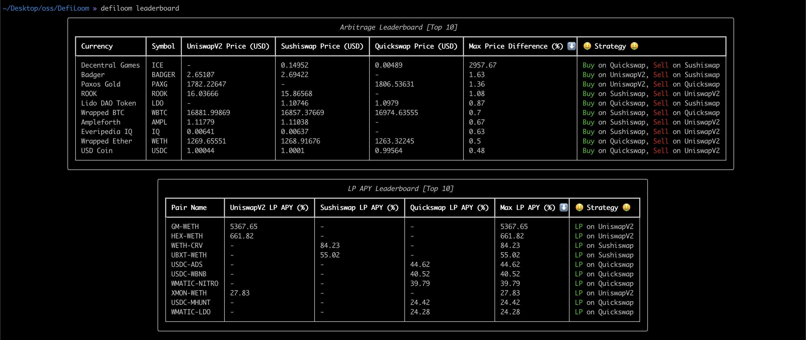
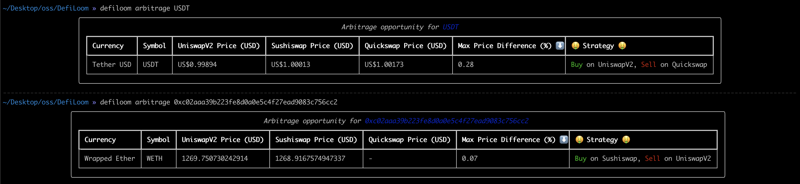
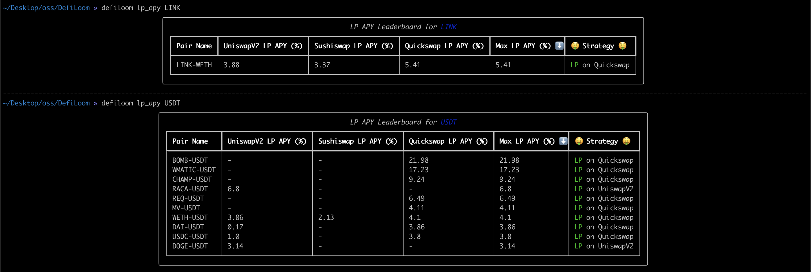

# DefiLoom

A CLI tool that uses PowerLoom's DeFi API to discover Arbitrage and LP APY opportunities.

## Demo

[](https://asciinema.org/a/542338)

## Installation

```bash
$ git clone https://github.com/eshaan7/DefiLoom
$ cd DefiLoom/
$ DefiLoom >> pip install -e .\[dev]
```

## Configuration / Basic Usage

### Invoking the command line

```bash
$ DefiLoom >> source .env
$ DefiLoom >> defiloom -h # or python -m src.main
Usage: defiloom [OPTIONS] COMMAND [ARGS]...

Options:
  --version   Show the version and exit.
  -h, --help  Show this message and exit.

Commands:
  arbitrage    Display Arbitrage opportunity for a specific ERC-20 token.
  leaderboard  Display Arbitrage and LP APY leaderboards
  lp_apy       Display LP APY leaderboard for a specific ERC-20 token.
```

### Set config

- Configuration secrets such as `POWERLOOM_API_KEY` are to be defined inside `.env` file.

## Usage

### `leaderboard` command

```bash
$ DefiLoom >> defiloom leaderboard -h
Usage: defiloom leaderboard [OPTIONS]

  Display Arbitrage and LP APY leaderboards

Options:
  -h, --help  Show this message and exit.
```

Example:



### `arbitrage` command

```bash
$ DefiLoom >> defiloom arbitrage -h
Usage: defiloom arbitrage [OPTIONS] ERC20_SYMBOL_OR_ADDRESS

  Display Arbitrage opportunity for a specific ERC-20 token.

  ERC20_SYMBOL_OR_ADDRESS is ERC-20 token contract address or symbol.

Options:
  -h, --help  Show this message and exit.
```

Example:




### `lp_apy` command

```bash
$ DefiLoom >> defiloom lp_apy -h
Usage: defiloom lp_apy [OPTIONS] ERC20_SYMBOL

  Display LP APY leaderboard for a specific ERC-20 token.

  ERC20_SYMBOL is ERC-20 token contract address or symbol.

Options:
  -h, --help  Show this message and exit.
```

Example:

